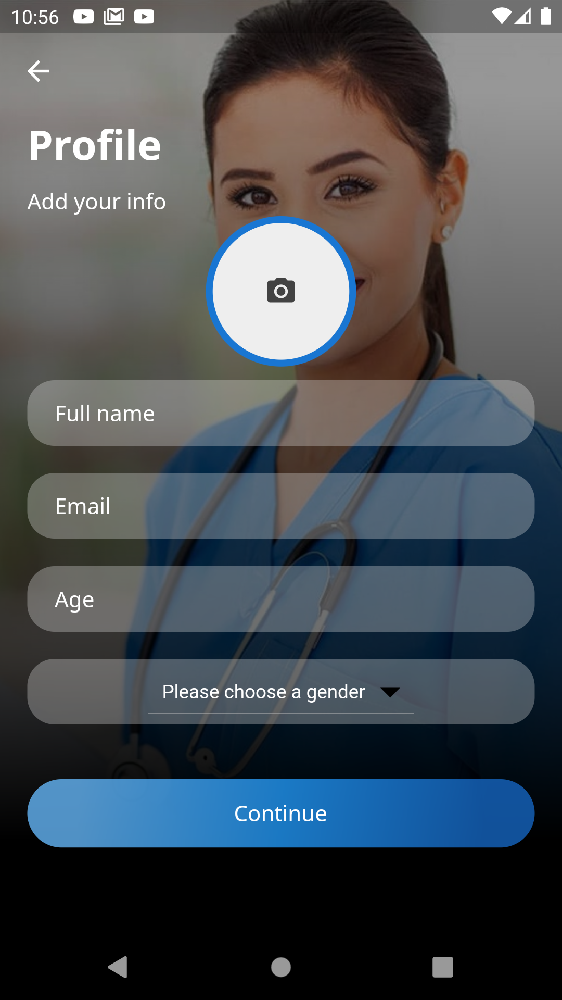
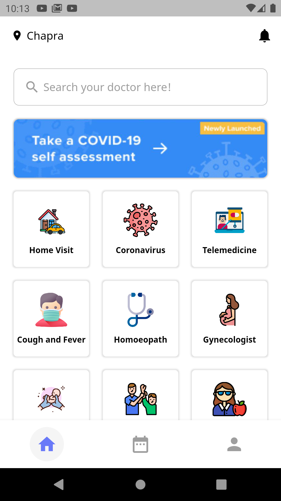
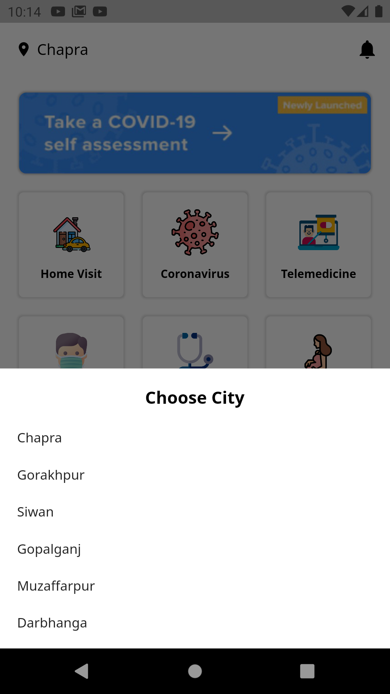
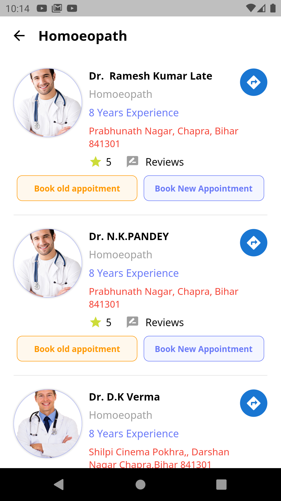
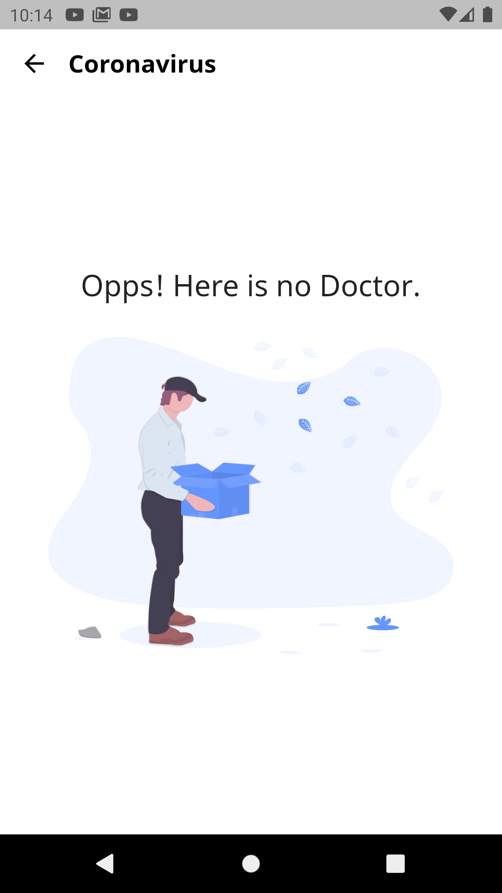
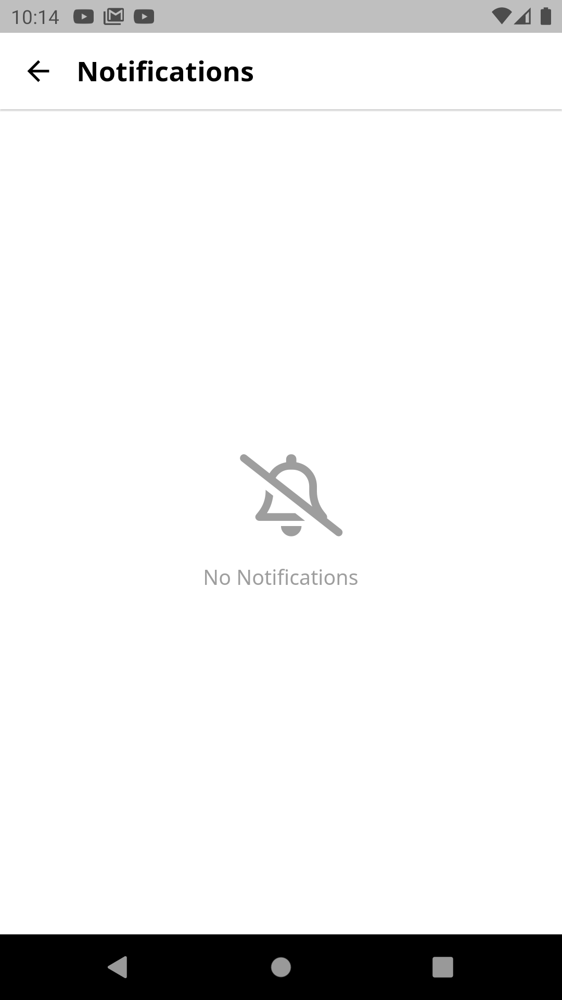
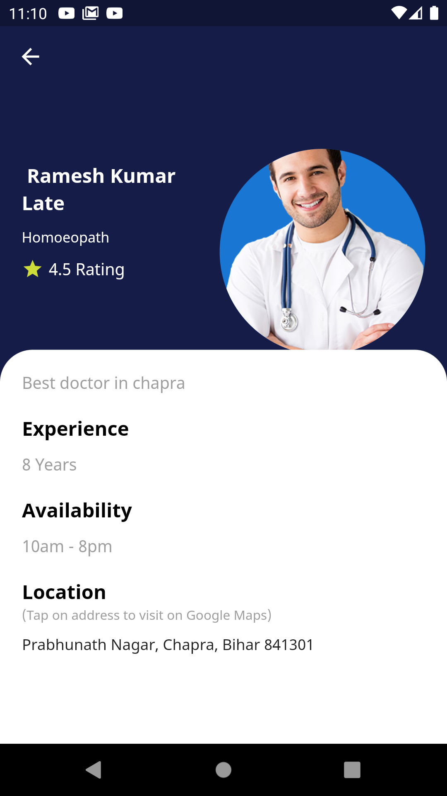
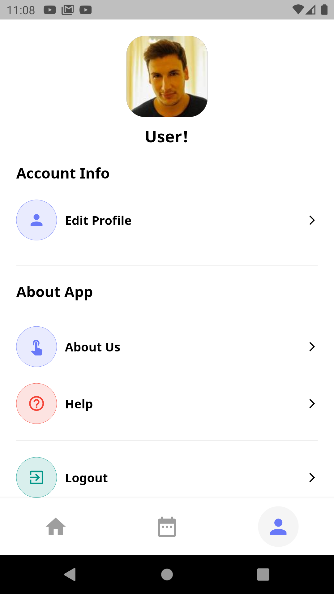
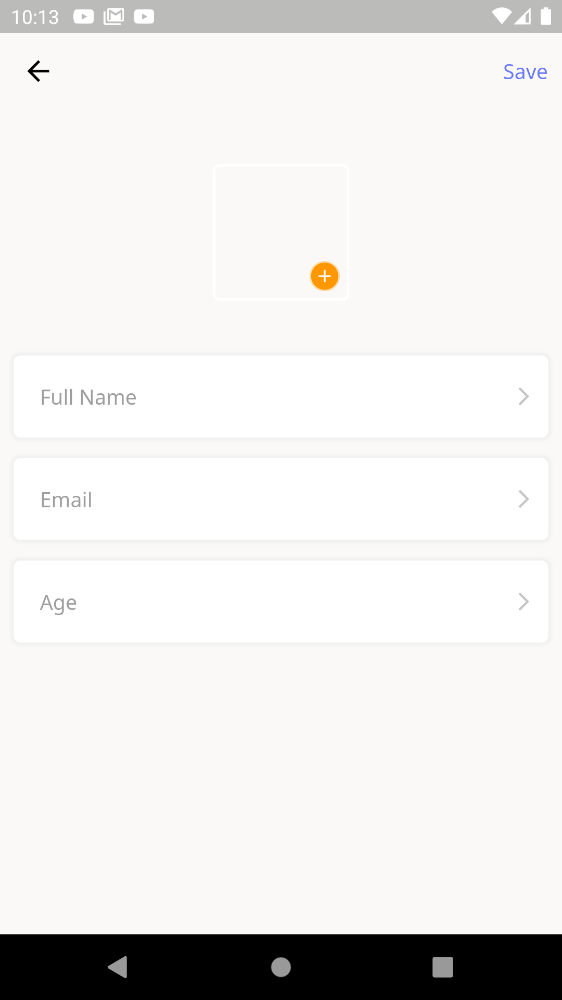
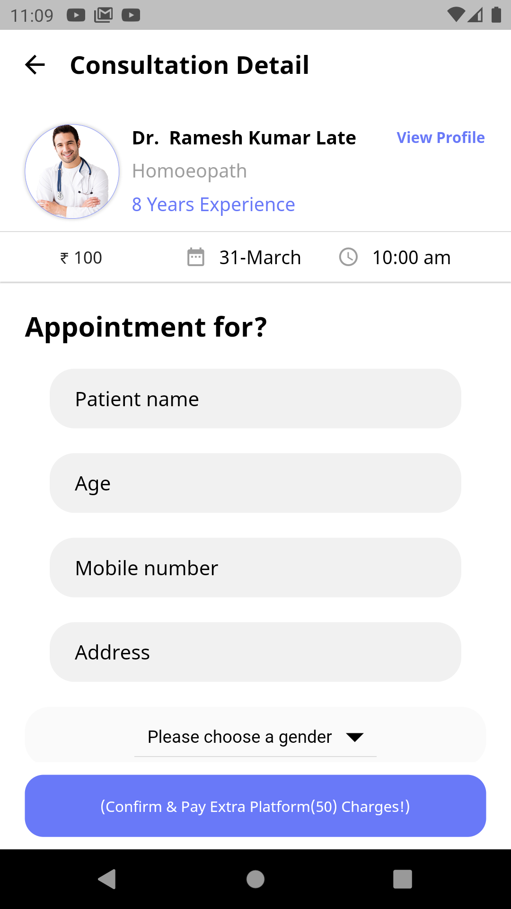

# Doctor Appointment Application in Flutter

An app for taking online booking appointment for a doctor at your home and you can take consultation. This application is linekd with Firebase for Authentication, Firestore Database

## Getting Started
    1. git clone https://github.com/gourav6m17/doctor_app.git
    2. after cloning flutter pub get
    3. add firebase to your project [demonstrate here](https://firebase.google.com/docs/flutter/setup?platform=android)
    4. optional: add razorpay test api to the file lib/constant/constant.dart
    5. flutter run
## Features
    - Working Online with [**Firebase**](https://firebase.google.com/) as Backend Service
    - Realtime data
    - Location based
    - [**Razorpay**](https://razorpay.com/) Payment Gateway integrated for payment acceptence
    - Easy Customisation for themes color
    - Provider used for state management

## Screenshot
    - Login/Sign up 
        For Login and Sign up Phone Auth is used from Firebase Authenication.
    
     
    
    - Home 
        Clean and Responsive view of Home having categories of specialist according to the dieases.
        
    - Choose City    
        You can change city and accrodingly you will get specialists.
        
    - View Doctors and Labs    
         | |
        
        
    - Search Doctors
                
    - Notification     
        
    - Profile
         |  |
        
        
    - Book appointment
        
## Credits
  - UI/UX inspired [**here**](https://www.youtube.com/watch?v=dmX7odWOIqc)  
       
## License
Copyright 2022 Gourav Kumar

Licensed under the Apache License, Version 2.0 (the "License"); you may not use this file except in compliance with the License. You may obtain a copy of the License at

http://www.apache.org/licenses/LICENSE-2.0

Unless required by applicable law or agreed to in writing, software distributed under the License is distributed on an "AS IS" BASIS, WITHOUT WARRANTIES OR CONDITIONS OF ANY KIND, either express or implied. See the License for the specific language governing permissions and limitations under the License.        